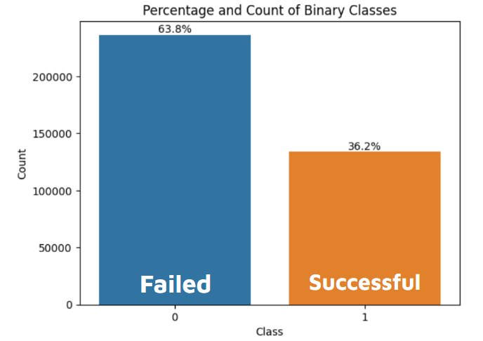
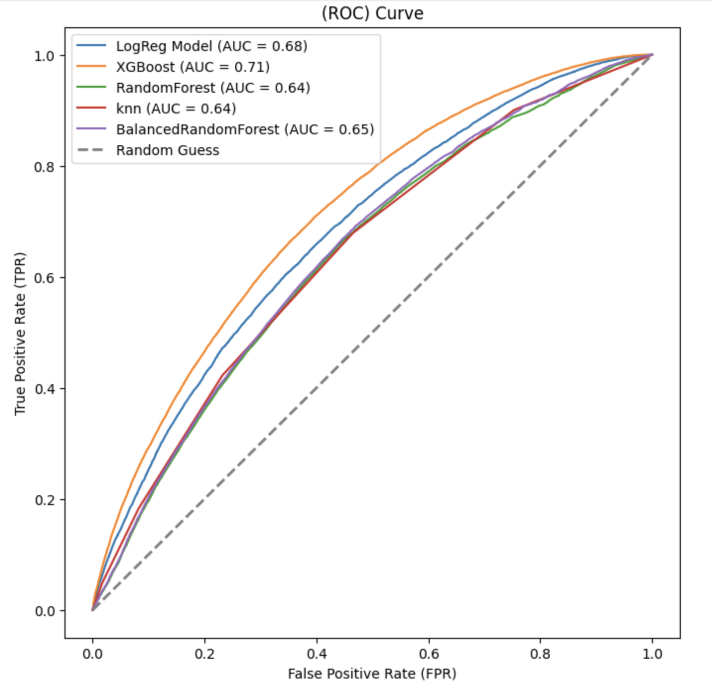
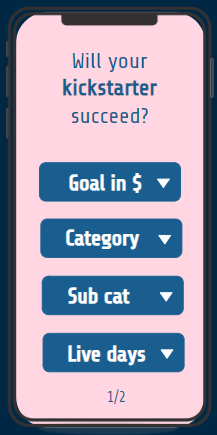

# Kickstarter project - Advanced Machine Learning 

The goal of this machine learning project is to predict the **success** or **failure** of a kickstarter project through various machine learning models.

The data for this project can be found here: [Kaggle kickstarter data](https://www.kaggle.com/datasets/ulrikthygepedersen/kickstarter-projects/data).

---

## The data set and variables

After exploring our Kickstarter data, we define our target as being the column "State", which reflects the success or failure of a project. We have four classes in the column: Successful, Failed, Canceled, Live and Suspended. We chose to remove live and suspended, since they only compromise less than 1.5% of the data set (see count graph below). We also chose to merge all canceled projects into failed projects. That gave us a split between success and failure of 64% and 36%, respectively.

In order to be able to predict a Kickstarter project's destiny before the launch of a Kickstarter campaign, we only selected features which would be known before launch. These features were: Goal, Live days, Category and Sub category. 

## Machine learning models

We trained several Machine learning models on our data. Our aim was to maximize recall (True Positive Rate), to make sure our models would capture as many successful projects as possible. See the models below and how they scored on recall:

- Logistic Regression Classifier - recall: 0.68
- KNN Classifier - recall: 0.42
- Random Forest Classifier - recall: 0.55
- Balanced Random Forest Classifier - recall: 0.81
- XGBoost Classifyer - recall: 0.44

The Balanced Random Forest Classifier performed the best in terms of recall. However, if we look at the ROC curve and AUC (Area under ROC curve), it is clear that the XGBoost performs better in the sense that it's generating a lower false positive ratio at different thresholds. See ROC and AUC below. 

## Product - The KickSass app

In order to incorporate our models into a product, we decided to present an app, where you define a Goal, Category, Sub Category, Live days and country. The app would then process your input and give an estimation of whether or not your Kickstarter project will succeed. 

